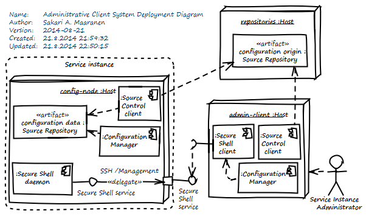

<!--- file: README.md -->

Administrative Client System (ACS)
==================================

This is a configuration management database (CMDB)
for tracking configuration items (CIs) related to
deployment of administrative client systems.

An administrative client system is service administrators' local node
for the purpose of accessing service instance management networks
from outside over the Internet.
For security reasons, administrative client systems
are kept separate from general purpose personal computers.

Current implementation
----------------------

This Git repository contains Ansible playbooks for
the setup of an environment based on:

Purpose of ACS component           | Supported alternatives
---------------------------------- | ----------------------------------
Client hardware                    | Linux compatible personal computer
Operating System                   | Fedora
Revision Control                   | Git
Configuration Management           | Ansible
Release Management                 | Apache Maven

Some developer tools are included because the service instance is currently
ongoing development and its administration is akin to software development.
With more mature services, install only the tools that you need and
keep administrative client systems completely separate from development environments.

Prerequisites
-------------

1. Basic Linux system administration skills
1. File system encryption know-how
1. Two or more physical
   [document safes](https://github.com/sakaal/service_platform_ansible/wiki/Document-safe)
   with one or more people who have
   [administrative access](https://github.com/sakaal/service_platform_ansible/wiki/Administrative-access-plan)

Deployment procedure
--------------------

1. Prepare the ACS hardware, BIOS, etc.

1. Install the operating system from a trusted source, such as a checksum-verified installation medium.

1. Encrypt the file system.

1. Create a local user account during the install.

1. Record the local access credentials offline (using a physical writing instrument and materials):
    - A label stating: "Administrative Client System"
    - Identification of the ACS hardware and network interface physical address
    - Fixed network settings, such as hostname, domain name, and static network address, if any
    - Date and time of deployment
      according to Coordinated Universal Time (UTC)
      in ISO 8601 format (`YYYY-MM-DD hh:mmZ`)
    - Name and contact information of the person responsible for the deployment
    - The local access credentials:
        - File system encryption passphrase
        - Root account password
        - Your other local user account passwords

1. Keep redundant copies of the local access credentials secure in offline document safes
   at two or more geographically separated locations,
   one of which may reside with each person responsible for administrative duties.

1. As the local user on the newly installed client, prepare the ACS configuration deployment:

        sudo yum install git ansible
        git clone https://github.com/sakaal/admin_client.git
        cd admin_client
        cp host_vars/localhost.sample host_vars/localhost

1. Edit `host_vars/localhost` with the local user account details.
   Add also the already existing account that you created during install.
   You can add more local users, if multiple administrators use the same client
   or otherwise needed. Then run:

        ansible-playbook -K admin_client.yml -i local

1. If you have a backup copy of an existing sensitive data image,
   look up the passphrase in the document safe and restore the backup.
   Make sure that the file permissions are restricted
   to the service administrators only. Then open it:

        sudo open_sensitive_data

1. If you do not have a sensitive data image yet,
   then generate a new strong passphrase and record it
   the same way you did the local access credentials above.
   Initialize a new sensitive data image using the passphrase:

        sudo init_sensitive_data

1. If the reason why you are deploying a new ACS is that there was a
   security incident, then consider revoking or at least changing all
   the private keys on the sensitive data volume, if any.

1. Configure all the required keys, certificates, and other security
   critical settings as appropriate on the sensitive data volume.

1. Close the sensitive data volume and make new backup copies
   on at least two removable media devices. Check that the backup
   storage devices have several years of life left. Keep offline
   backups the same way as the local access credentials above.

1. Authorize relevant keys on the new ACS
   for access to the service instance configuration source repository.
   Usually, this means registering an ACS user's public key with
   the source respository service.

1. Retrieve the latest service instance configuration data from the
   source respository.

The ACS is now ready for use.
